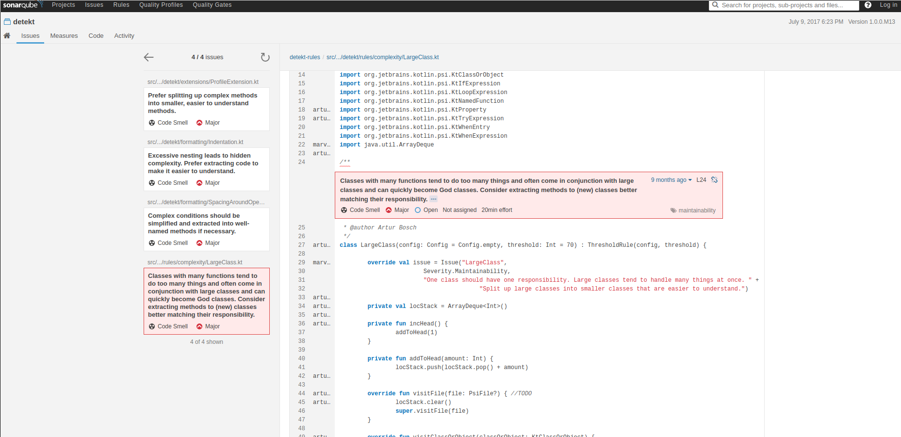
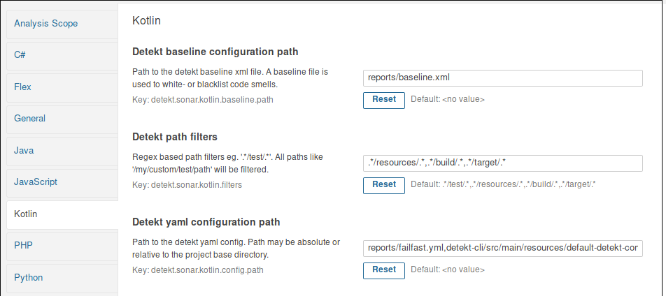

# sonar-detekt

### Features

- Integrates [detekt](https://github.com/detekt/detekt) for static code analysis
- Default quality profiles `detekt active` (80+ rules) and `detekt all` (164+ rules)
- Supports SonarQube 8.9+
- Supports detekt's `yaml config`, `baseline.xml` and `excludes`
- Seamless integration with official SonarKotlin (no redundant features)

#### Non supported features as of 2.x.x

- code coverage
- test reports
- syntax highlighting
- metrics

The official SonarKotlin plugin now supports these features.

### Usage

#### Sonar Update Center

- Administration > Marketplace > Search for detekt

#### Building from source

- `git clone https://github.com/detekt/sonar-detekt`
- `cd sonar-detekt`
- `mvn verify`
- `cp target/sonar-detekt-<version>.jar $SONAR_HOME/extensions/plugins`
- `cd $SONAR_HOME/bin/<OS>`
- `./sonar.sh restart`

### Configurations, Baselines and Filters

Read about detekt configuration files [here](https://detekt.github.io/detekt/configurations.html)
and about detekt baseline formats [here](https://detekt.github.io/detekt/baseline.html).

Best ways to get started is to configure the `detekt-gradle-plugin` in your project and use its `detektBaseline` and 
`detektGenerateConfig` tasks.
- `detektGenerateConfig` copies the default configuration file which you can use to turn on and off rules and set 
appropriate threshold values for some rules.
- `detektBaseline` analyzes your project and generates a baseline xml file with all your current findings. This 
findings won't get reported anymore in sonar.

##### Settings

To make use of this features, you have to set up some properties:

__detekt path filters__ support multiple regex entries by adding a `,` for separating.
__detekt yaml configuration path__ also supports multiple configuration files where the first entered override some 
values of the later added config files.

##### Limitations

Sonar analyzes each module individually which makes it harder to search for your config files.
If you use relative paths, sonar-detekt first tries to find the provided path inside this module and if it can't find
 it, we are searching for the file in the parent folder. This leads to the limitation that only projects with 
 sub-projects of depth 1 are supported. If you need more config files in your project hierarchies, provide them in 
 the sub-projects with the same relative path available.

### Mentions

As mentioned/used in ...

- [Sonarqube code coverage for Kotlin on Android with Bitrise](https://android.jlelse.eu/sonarqube-code-coverage-for-kotlin-on-android-with-bitrise-71b2fee0b797)
- [Sample Android-Gradle-Sonar-Kotlin integration](https://github.com/marcinbak/android-sonar-kotlin)

## License

